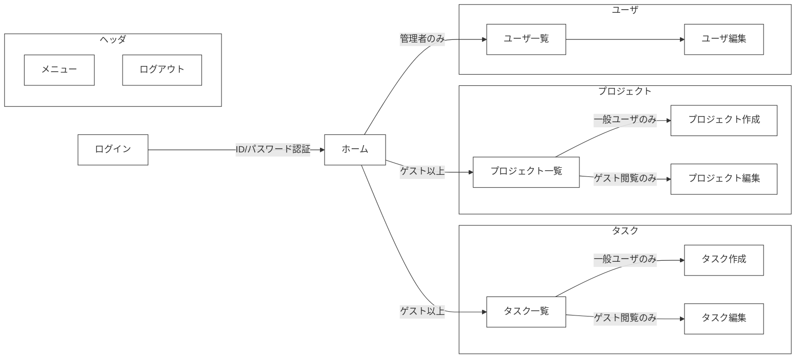
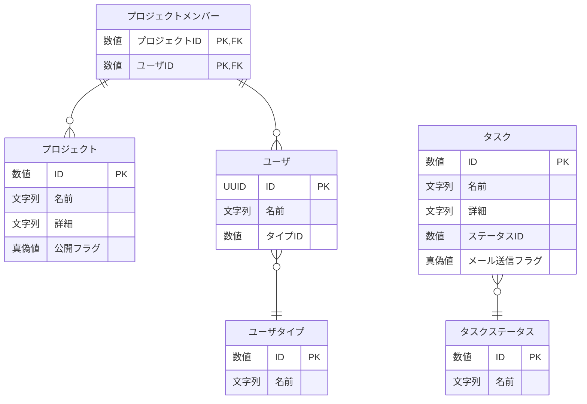
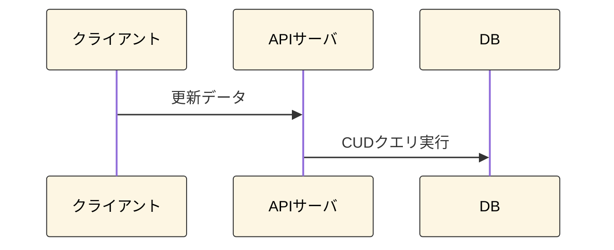
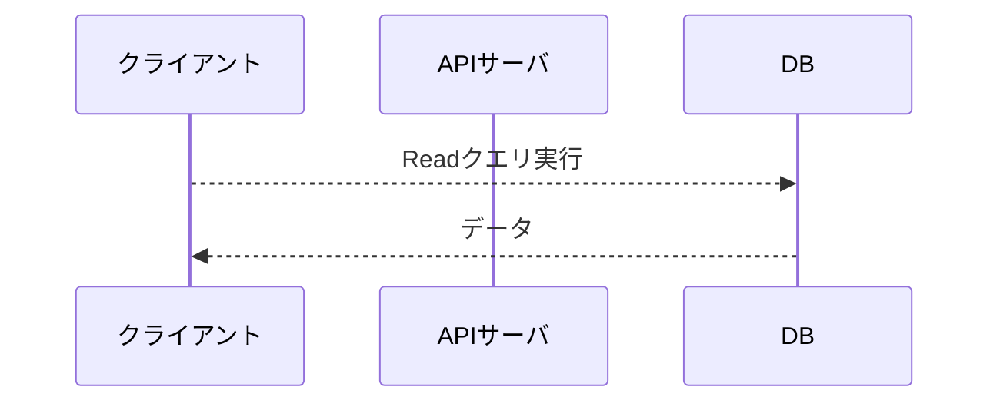

## はじめに
御覧いただきありがとうございます。\
本アプリは、ポートフォリオ用に作成したサンプルアプリです。\
Next.jsとSupabaseを使用し、ログイン認証からCRUDまでWebアプリ全体を通した機能を実装しました。\
以下リンクより実際に操作してお試しください。\
\
[【サンプルアプリを起動する】](https://sample-react-app-z6qm.vercel.app/login)\
（ゲストログインボタンを押下することでログインなしで閲覧が可能です。）\


## 目次
- [はじめに](#はじめに)
- [目次](#目次)
- [画面イメージ](#画面イメージ)
  - [①一覧画面](#一覧画面)
  - [②詳細画面](#詳細画面)
  - [③ポップアップ画面](#ポップアップ画面)
- [画面遷移](#画面遷移)
- [開発環境（使用技術）](#開発環境使用技術)
  - [所感](#所感)
- [テーブル構成](#テーブル構成)
- [CRUDの処理フロー](#crudの処理フロー)
  - [登録、更新、削除](#登録更新削除)
  - [読込](#読込)
- [認証・認可](#認証認可)
  - [ユーザ登録処理](#ユーザ登録処理)
  - [ユーザ認可処理](#ユーザ認可処理)
- [フォルダ構成](#フォルダ構成)
- [さいごに](#さいごに)


## 画面イメージ
実装した画面のパターンは主に以下３つになります。

### ①一覧画面
- `フィルター`、`ソート`、`ページネーション`などの機能をつけています。
- 検索ボタンを押下すると、検索条件欄が自動で閉じるようにしています。
- フィルターに関しては、URLの`クエリストリングからも設定が可能`です。


---
### ②詳細画面
- データの`作成`、`更新`、`削除`を行えます。
- データ更新時にクライアント側で入力内容の`バリデーションチェック`を行います。


---
### ③ポップアップ画面
- モーダル表示でポップアップを開きます。
- 入力されたデータを親画面に返したり、データ更新を行います。\


## 画面遷移
- 現在携わっている案件からよくあるパターンの画面を選択し、以下としました。
- 特に権限周りにはこだわっています。権限がない場合、画面アクセスへの制限だけでなく、メニューからも非表示になるようにしました。

- ユーザの権限によってメニューや画面にアクセス制限を設けています。


## 開発環境（使用技術）
- フレームワーク: `Next.js`
  - ルーティングシステム: `App Router`
  - UI: `Mantine`（主要コンポーネント）＋ `Tailwind CSS`（レイアウト補助）
  - REST API: `Route Handlers`
  - その他:
    - `Zod`: バリデーションチェック用ライブラリ
    - `React Hook Form`: 入力フォームの検証を最適化したライブラリ。Zodと組み合わせて使用。
    - `SWR`: データ取得処理を最適化するためのライブラリ。
- DB: `Supabase`（PostgreSQLベースのクラウドDB）
- デプロイ: `Vercel`
- エディタ: `VSCode`

### 所感
- 今回はNext.jsを深く知るため、極力メジャーなライブラリを多く使用しました。
- Next.jsでの開発は全ての工程に無駄がなく、ストレス無しで最高の開発体験でした。

## テーブル構成
サンプルアプリのため、なるべく`一対多`、`多対多（中間テーブル）`など複数のパターンを検証できるようにしました。


- ※作成日時、更新日時は省略しています。


## CRUDの処理フロー
CQRS原則に基づき、`更新系はAPI経由`、`参照系はクライアント直アクセス`としています。
### 登録、更新、削除
- データ更新時は`楽観的排他チェック`（存在確認、更新／削除確認）を行います。
- Supabaseは呼び出し側でトランザクション制御ができないため、必要に応じてストアド・プロシージャを作成しました。

---
### 読込
- クライアントからは`読み取りクエリのみ許可`します。


## 認証・認可
### ユーザ登録処理
- ユーザ登録は主に２段階に分かれています。
  - ①Supabaseのユーザ登録（メールアドレスとパスワード）
  - ②アプリ用のユーザ登録（①で登録されたIDとアプリ用ユーザテーブルとの紐づけ）
- 本来は一つのフォーム画面だけで登録を完了したかったが、メール認証との兼ね合いから以下実装としました。

#### 操作の手順

1. メールアドレスとパスワードを入力し新規登録を行います。\

1. 確認メールからリンクをクリックして初回の認証をします。

2. ログインし、ユーザ情報がない場合、ユーザ登録ポップアップを表示します。（ここでアプリ側のユーザ登録を行います。）\


---
### ユーザ認可処理
- ユーザ認可処理では、データベースにアクセスし、`セッションを保持しているかどうか`を確認します。\
しかし、毎回取得処理が走ると通信量やユーザ体験に影響が出るため、`キャッシュによる効率化`を図っています。

#### 処理の流れについて

1. ログイン画面以外の画面アクセスするとユーザ認可処理が走ります。（セッションの確認）
2. セッションが切れている場合、ログイン画面に戻ります。\


## フォルダ構成
- `feature-based`で構成することで新機能を作る際、コピペして簡単に作れるようにしました。\
（プロジェクト関連の画面はタスクをコピペして名前を変更しただけで８割方の実装が完了しました。）
- フロントエンドとバックエンドを両方同じ機能フォルダに入れることで、視認性がよくなりました。
- フロントエンドとバックエンドで`データ取得クエリやスキーマを共有`することで開発速度をかなり上げることができました。
```
/app
  ├── (task)/
  │   ├── .../
  ├── (project)/              # 機能ごとにフォルダを分離しています。
  │   ├── _api-client/             # バックエンドAPI呼び出し
  │   ├── _data-access/            # Supabase クエリをラップしたデータ更新層
  │   ├── _hooks/                  # フック
  │   ├── _query/                  # データ取得クエリ。CQRSのQuery側の処理を担当。
  │   ├── _schema/                 # スキーマ（Zodの型を定義する）
  │   ├── _service/                # バックエンド側のビジネスロジック層。
  │   ├── projects/                # 一覧ページのルーティング用フォルダ
  │   │   └── page.tsx                   # プロジェクト一覧ページ
  │   │   ├── api/                       # REST APIの定義
  │   │   ├── ...                        # プロジェクト一覧ページのフォルダ類
  │   │   ├── [id]/                      # 詳細ページの動的ルーティングフォルダ
  │   │   │   ├── page.tsx                    # 詳細ページ
  │   │   │   ├── ...                         # 詳細ページ専用のフォルダ類
  │   │   ├── new/                       # 新規作成ページ
  │   │   │   ├── page.tsx
  ├── (core)/                 # コア機能を格納する
  ├── (shared)/               # 共通で使用するコンポーネントや関数を格納する
```

## さいごに
- 本プロジェクトを御覧いただきありがとうございました。
- もし気になる点がありましたら、気軽にお聞きください。
  
