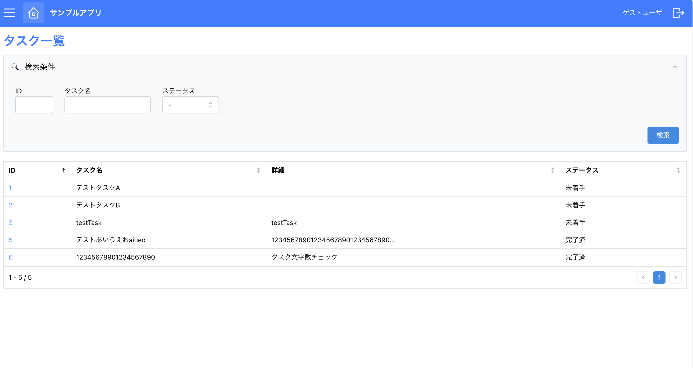
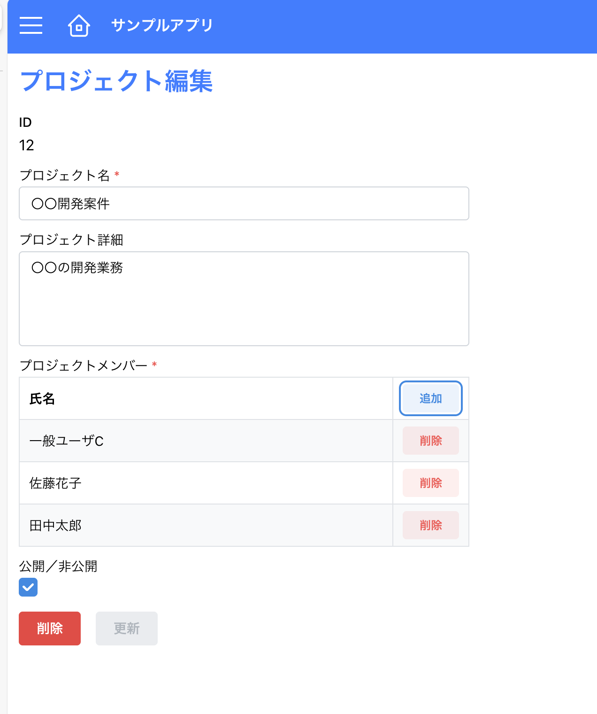
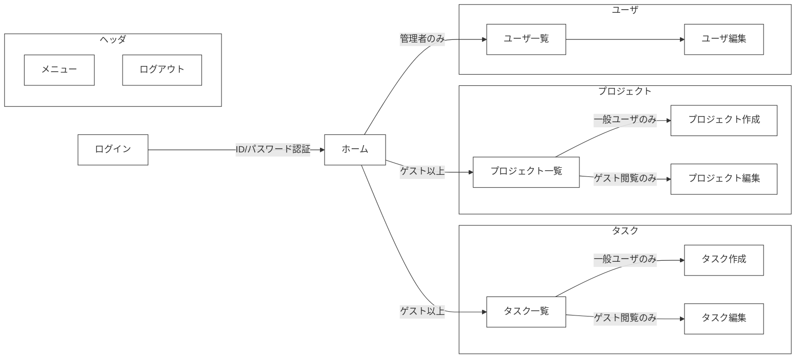
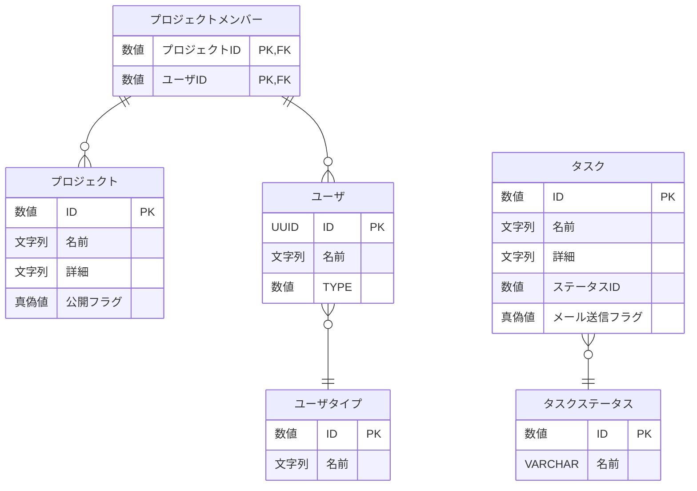
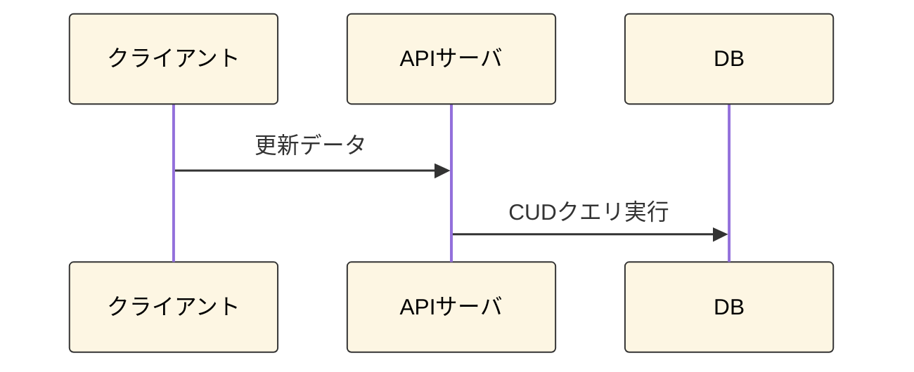
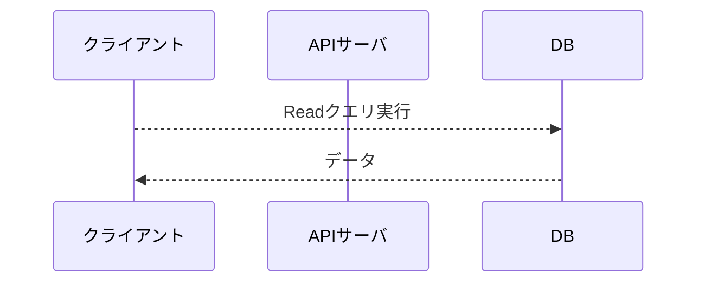

## はじめに
御覧いただきありがとうございます。\
本アプリは、ポートフォリオ用に作成したサンプルアプリです。\
Next.jsとSupabaseを使用し、ログイン認証からCRUDまでWebアプリ全体を通した機能を実装しました。\
以下リンクより実際に操作してお試しください。\
\
[【サンプルアプリを起動する】](https://sample-react-app-z6qm.vercel.app/login)\
（ゲストログインボタンを押下することでログインなしで閲覧が可能です。）\


## 目次
- [はじめに](#はじめに)
- [目次](#目次)
- [画面イメージ](#画面イメージ)
  - [①一覧画面](#一覧画面)
  - [②詳細画面](#詳細画面)
  - [③ポップアップ画面](#ポップアップ画面)
- [画面遷移](#画面遷移)
- [開発環境（使用技術）](#開発環境使用技術)
- [テーブル構成](#テーブル構成)
- [CRUDの処理フロー](#crudの処理フロー)
  - [登録、更新、削除](#登録更新削除)
  - [読込](#読込)
- [認証・認可](#認証認可)
  - [ユーザ登録処理](#ユーザ登録処理)
  - [ユーザ認可処理](#ユーザ認可処理)
- [フォルダ構成](#フォルダ構成)
- [URLについて](#urlについて)


## 画面イメージ
実装した画面のパターンは主に以下３つになります。

### ①一覧画面


- フィルター、ソート、ページネーションなどの機能を付与しています。
---
### ②詳細画面


- データの作成、更新、削除を行えます。
- データ更新時にクライアント側で入力内容のバリデーションチェックを行います。
---
### ③ポップアップ画面


- モーダル表示でポップアップを開きます。
- 入力されたデータを親画面に返したり、データ更新を行います。

## 画面遷移

- ユーザの権限によってメニューや画面にアクセス制限を設けています。


## 開発環境（使用技術）
- フレームワーク: `Next.js`
  - ルーティングシステム: `App Router`
  - UI: `Mantine`（主要コンポーネント）＋ `Tailwind CSS`（レイアウト補助）
  - REST API: `Route Handlers`
  - その他:
    - `Zod`: バリデーションチェック用ライブラリ
    - `React Hook Form`: 入力フォームの検証を最適化したライブラリ。Zodと組み合わせて使用。
    - `SWR`: データ取得処理を最適化するためのライブラリ。
- DB: `Supabase`（PostgreSQLベースのクラウドDB）
- デプロイ: `Vercel`
- エディタ: `VSCode`

## テーブル構成


- 補足: 作成日時、更新日時は省略しています。


## CRUDの処理フロー
- CQRS原則に基づき、更新系（Command）はAPI経由、参照系（Query）はクライアント直アクセスとしています。
### 登録、更新、削除

- データ更新時は`楽観的排他チェック`（存在確認、更新／削除確認）を行っています。
---
### 読込

- クライアントからは読み取りクエリのみ許可します。

## 認証・認可
### ユーザ登録処理
1. メールアドレスとパスワードを入力し新規登録を行います。

2. 確認メールからリンクをクリックして初回の認証をします。

3. ログインし、ユーザ情報がない場合、ユーザ登録ポップアップを表示します。


---
### ユーザ認可処理
1. ログイン画面以外の画面アクセス時にユーザ認可処理が走ります。
2. セッションが切れている場合、ログイン画面に戻ります。


## フォルダ構成
```
/app
  ├── (task)/
  │   ├── .../
  ├── (project)/              # 機能ごとにフォルダを分離しています。
  │   ├── _api-client/             # バックエンドAPI呼び出し
  │   ├── _data-access/            # Supabase クエリをラップしたデータ更新層
  │   ├── _hooks/                  # フック
  │   ├── _query/                  # データ取得クエリ。CQRSのQuery側の処理を担当。
  │   ├── _schema/                 # スキーマ（Zodの型を定義する）
  │   ├── _service/                # バックエンド側のビジネスロジック層。
  │   ├── projects/                # 一覧ページのルーティング用フォルダ
  │   │   └── page.tsx                   # プロジェクト一覧ページ
  │   │   ├── api/                       # REST APIの定義
  │   │   ├── ...                        # プロジェクト一覧ページのフォルダ類
  │   │   ├── [id]/                      # 詳細ページの動的ルーティングフォルダ
  │   │   │   ├── page.tsx                    # 詳細ページ
  │   │   │   ├── ...                         # 詳細ページ専用のフォルダ類
  │   │   ├── new/                       # 新規作成ページ
  │   │   │   ├── page.tsx
  ├── (core)/                 # コア機能を格納する
  ├── (shared)/               # 共通で使用するコンポーネントや関数を格納する
```

## URLについて
- `https://xxx/projects`: プロジェクト一覧
- `https://xxx/projects/1`: IDが1のプロジェクトの詳細画面
- `https://xxx/projects/new`: 新規プロジェクト作成画面
- `https://xxx/projects/api`: プロジェクト関連のAPIエンドポイント
