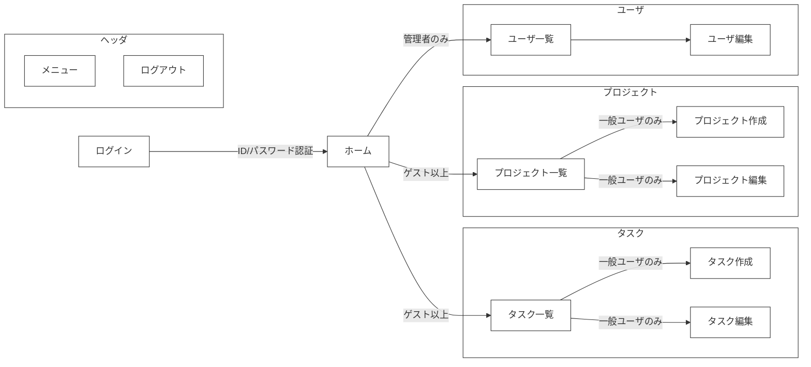
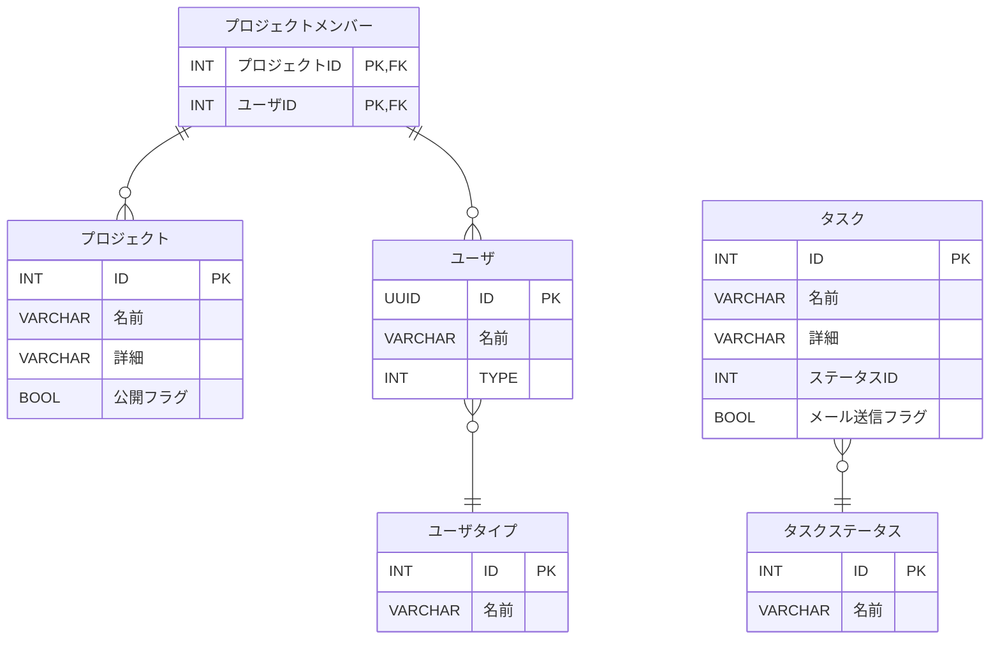
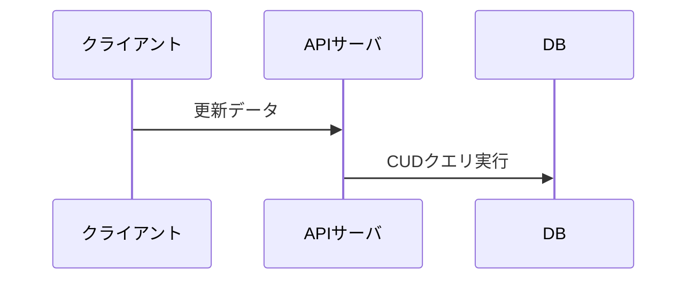
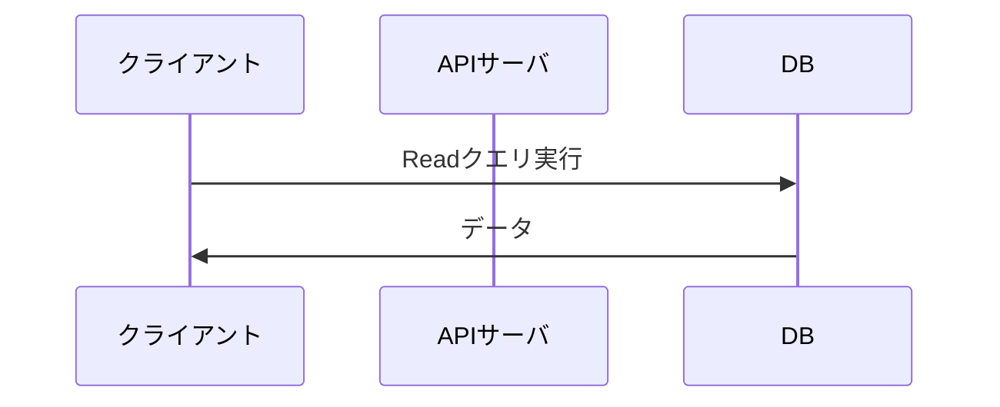

## 目次
- [目次](#目次)
- [概要](#概要)
- [画面イメージ](#画面イメージ)
  - [一覧画面](#一覧画面)
  - [詳細画面](#詳細画面)
  - [ポップアップ画面](#ポップアップ画面)
- [画面遷移](#画面遷移)
- [開発環境（使用技術）](#開発環境使用技術)
- [テーブル構成](#テーブル構成)
- [データ登録、更新、削除、読込の処理フロー](#データ登録更新削除読込の処理フロー)
  - [登録、更新、削除](#登録更新削除)
  - [読込](#読込)
- [認証・認可](#認証認可)
  - [ユーザ登録処理](#ユーザ登録処理)
  - [ユーザ認可処理](#ユーザ認可処理)
- [フォルダ構成](#フォルダ構成)


## 概要
本アプリは、ポートフォリオ用に作成したサンプルアプリです。
企業向けのプロジェクト管理アプリを想定し作成しました。
Next.jsとSupabaseの構成でログイン認証からCRUDまでWebアプリとしての最低限の機能を実装しています。

## 画面イメージ
実装した画面のパターンは主に以下３つになります。

### 一覧画面


- フィルター、ソート、ページネーション等を行えます。

### 詳細画面


- データの作成、更新、削除を行えます。
- データ更新時にクライアント側で入力内容のバリデーションチェックを行います。

### ポップアップ画面


- モーダル表示でポップアップを開きます。
- 入力されたデータを親画面に返したり、データ更新を行います。

## 画面遷移



## 開発環境（使用技術）
- フレームワーク: Next.js
  - ルーティングシステム: App Router
  - UI: Mantine（主要コンポーネント）＋ Tailwind CSS（レイアウト補助）
  - REST API: Route Handlers
  - その他:
    - Zod: バリデーションチェック用ライブラリ
    - React Hook Form: 入力フォームの検証を最適化したライブラリ。Zodと組み合わせて使用。
    - SWR: データ取得処理を最適化するためのライブラリ。キャッシュ機能も使用。
- DB: Supabase（PostgreSQLベースのクラウドDB）
- エディタ: VSCode

## テーブル構成

- 補足: 作成日時、更新日時は省略しています。


## データ登録、更新、削除、読込の処理フロー
- CQRS原則に基づき、更新系（Command）はAPI経由、参照系（Query）はクライアント直アクセスとしています。
### 登録、更新、削除

### 読込


## 認証・認可
### ユーザ登録処理
1. メールアドレスとパスワードを入力し新規登録を行う

2. 確認メールからリンクをクリックして初回の認証をする

3. ログインし、ユーザ情報がない場合、ユーザ登録ポップアップを表示する

### ユーザ認可処理
1. 画面アクセス時にユーザ認可処理が走る
2. セッションが切れている場合、ログイン画面に戻る


## フォルダ構成
```
/app
  ├── (task)/
  │   ├── .../
  ├── (project)/              # 機能ごとにフォルダを分離する
  │   ├── _api-client/             # 外部通信（Supabase REST API 呼び出し）
  │   ├── _data-access/            # Supabase クエリをラップしたデータ取得層
  │   ├── _hooks/                  # フック
  │   ├── _query/                  # データ取得クエリ
  │   ├── _schema/                 # スキーマ（Zodの型を定義する）
  │   ├── _service/                # ビジネスロジック層。CQRSのCommand側の処理を担当。
  │   ├── projects/                # 一覧ページのルーティング用フォルダ
  │   │   └── page.tsx                   # プロジェクト一覧ページ
  │   │   ├── api/                       # REST APIの定義
  │   │   ├── ...                        # プロジェクト一覧ページのフォルダ類
  │   │   ├── [id]/                      # 詳細ページの動的ルーティングフォルダ
  │   │   │   ├── page.tsx                    # 詳細ページ
  │   │   │   ├── ...                         # 詳細ページ専用のフォルダ類
  │   │   ├── new/                       # 新規作成ページ
  │   │   │   ├── page.tsx
  ├── (core)/                 # コア機能を格納する
  ├── (shared)/               # 共通で使用するコンポーネントや関数を格納する
```
- `https://xxx/projects`: プロジェクト一覧
- `https://xxx/projects/1`: IDが1のプロジェクトの詳細画面
- `https://xxx/projects/new`: 新規プロジェクト作成画面
- `https://xxx/projects/api`: プロジェクト関連のAPIエンドポイント
