| バージョン | 概要                             | 更新日     |
| ---------- | -------------------------------- | ---------- |
| 1.0.0      | README作成                       | 2025-11-4  |
| 1.1.0      | AIチャットボット機能の説明を追加 | 2025-11-23 |
| 1.1.1      | GCPのシステム構成図を追加        | 2025-11-23 |


## はじめに
御覧いただきありがとうございます。\
本アプリは、ポートフォリオ用に作成したWebアプリです。\
Next.jsとSupabaseを使用し、`ログイン認証`から`CRUD`までWebアプリ全体を通した機能を実装しました。\
また、Pythonのllama-indexとGCPで簡易LLMを構築し、`チャットボット機能`も導入しています。\
以下リンクより実際に操作してお試しください。\
\
[【サンプルアプリを起動する】](https://sample-react-app-z6qm.vercel.app/login)\
（ゲストログインボタンを押下することでログインなしで閲覧が可能です。）\
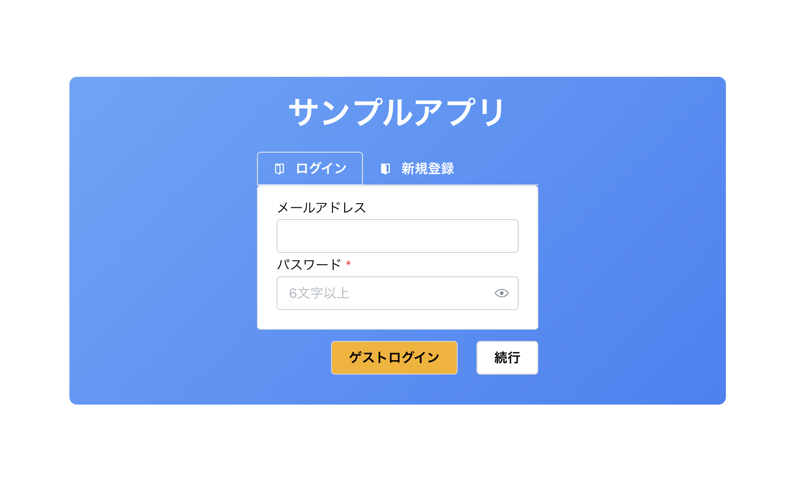

以下一般ユーザも用意していますので、こちらからログインするとタスクの更新やチャットボット機能の確認を行えます。

| メールアドレス       | パスワード |
| -------------------- | ---------- |
| general_a@sample.com | general_a  |

## 目次
- [はじめに](#はじめに)
- [目次](#目次)
- [機能一覧](#機能一覧)
  - [①一覧画面](#一覧画面)
  - [②詳細画面](#詳細画面)
  - [③ポップアップ画面](#ポップアップ画面)
  - [④AIチャットボット画面](#aiチャットボット画面)
- [画面遷移図](#画面遷移図)
- [開発環境（使用技術）](#開発環境使用技術)
- [システム構成](#システム構成)
- [テーブル構成](#テーブル構成)
- [CRUDの処理イメージ](#crudの処理イメージ)
  - [登録、更新、削除](#登録更新削除)
  - [読込](#読込)
- [認証・認可](#認証認可)
  - [ユーザ登録処理](#ユーザ登録処理)
  - [ユーザ認可処理](#ユーザ認可処理)
- [フォルダ構成](#フォルダ構成)
- [最後に](#最後に)


## 機能一覧

### ①一覧画面
- `フィルター`、`ソート`、`ページネーション`などの機能をつけています。
- 検索ボタンを押下すると、検索条件欄が自動で閉じるようにしています。
- フィルターに関しては、URLの`クエリストリングからも設定が可能`です。
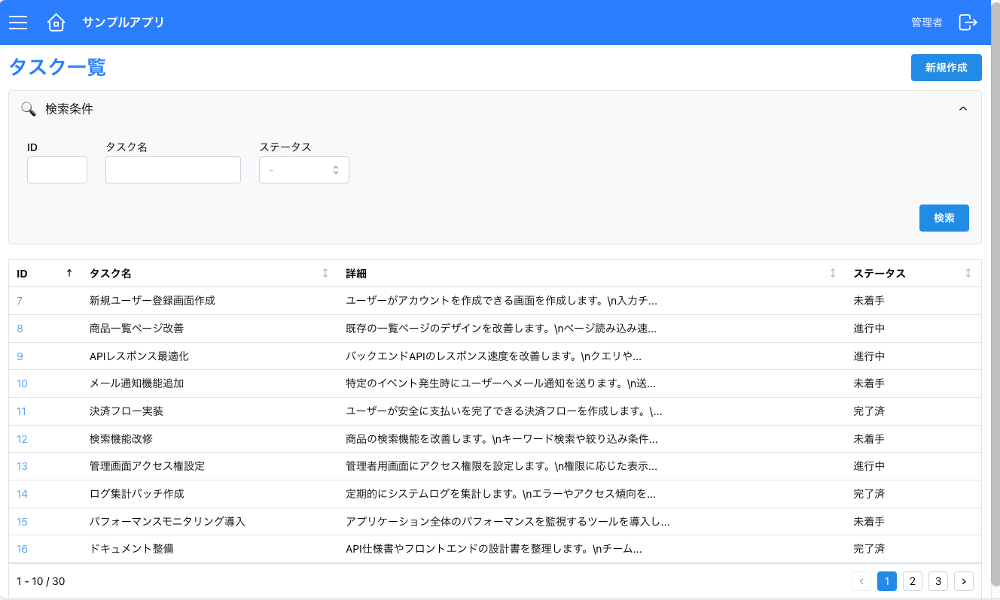

---
### ②詳細画面
- データの`作成`、`更新`、`削除`を行えます。
- データ更新時にクライアント側で入力内容の`バリデーションチェック`を行います。

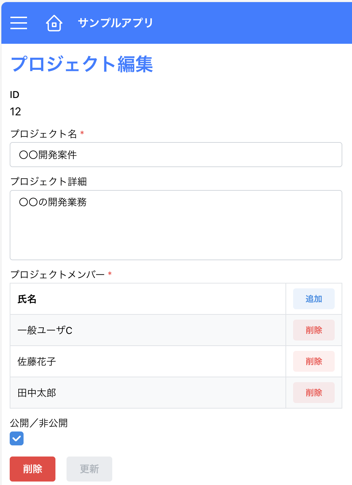
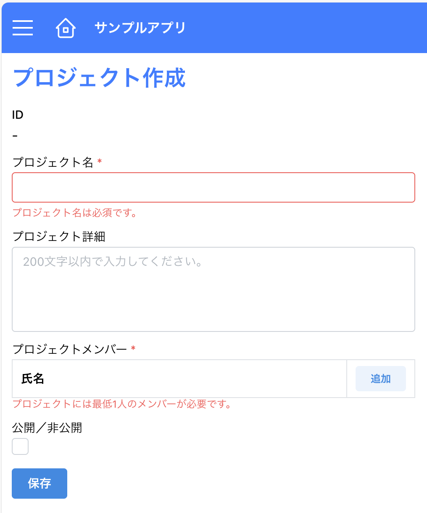

---
### ③ポップアップ画面
- モーダル表示でポップアップを開きます。
- 入力されたデータを親画面に返したり、データ更新を行います。

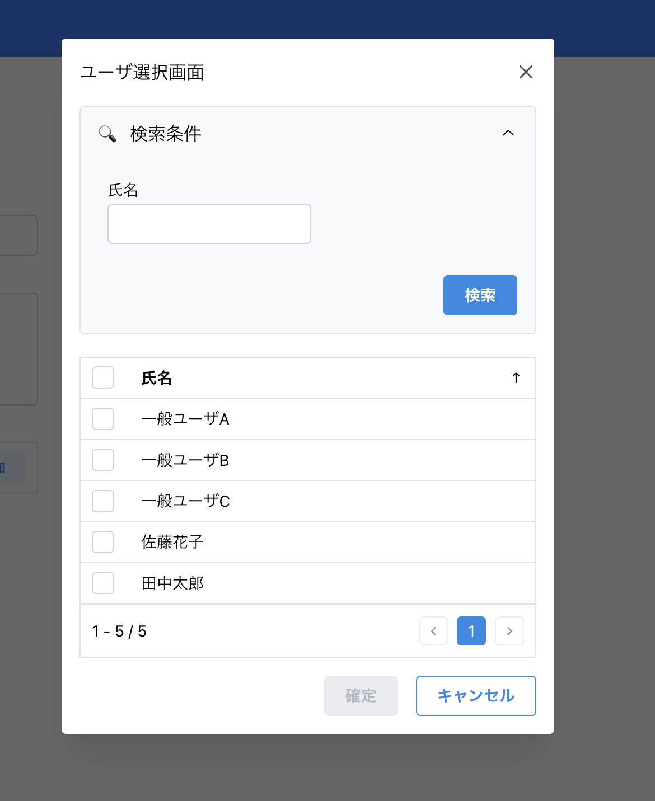


---
### ④AIチャットボット画面
- AIに読み込ませた内容について質問を行うことができます。
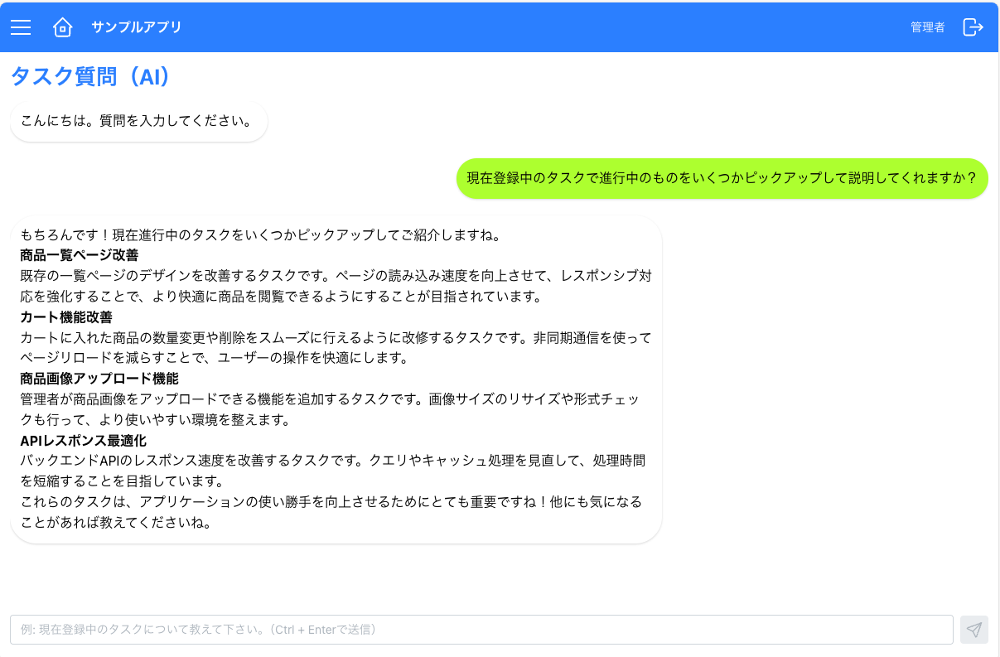


## 画面遷移図
- 現在携わっている案件からよくあるパターンの画面を選択し、以下としました。
- ユーザの権限によってメニューや画面にアクセス制限を設けています。
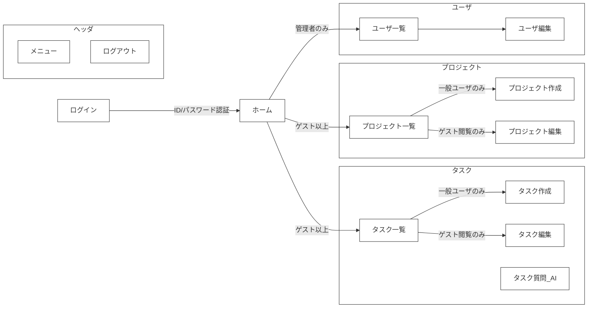


## 開発環境（使用技術）
- フロントエンド: `Next.js(App Router)`
  - UI: `Mantine`（主要コンポーネント）＋ `Tailwind CSS`
  - その他ライブラリ:
    - `Zod`: バリデーションチェック用ライブラリ
    - `React Hook Form`: 入力フォームの検証を最適化したライブラリ。Zodと組み合わせて使用。
    - `SWR`: データ取得処理を最適化するためのライブラリ。
  - デプロイ環境: `Vercel`
- バックエンド: `Next.js(Route Handlers)`
  - APIサーバ: `Route Handlers`
  - DB: `Supabase`（PostgreSQLベースのクラウドDB）
  - デプロイ環境: `Vercel`
- LLMサーバ:
  - 言語: Python3.12
  - FW: FastAPI
  - その他ライブラリ:
    - LLM: `llama-index` 
    - 型チェック: `pydantic`
  - デプロイ環境: `Docker` + `GCP Cloud Run`
  - ストレージ: `GCP Cloud Storage`
  - CI/CD: `GitHub Actions`
- エディタ: `VSCode`

## システム構成

- LLMサーバのコストを抑えるため、GCPの`Cloud Run`を使用（リクエストに応じて自動でスケールするオンデマンド実行のコンテナサービス）
- **LLMインデックスの保存**: 一日に一回、データベースに保存されているデータを取得し、LLMインデックスを生成し、ZIP形式で`Cloud Storage`に保存する。
- **LLMインデックスのロード**: APIが呼び出され、インスタンスが起動した際に`Cloud Storage`からLLMインデックスを読み込む（インスタンスが停止するまでは読みこんだLLMインデックスを使い回す。）
- **CI/CD**: GitHub Actionsを使用し、mainブランチにPUSHされたら自動でCloud Runにデプロイする。（現在CIは未実装）

## テーブル構成
サンプルアプリのため、なるべく`一対多`、`多対多（中間テーブル）`など複数のパターンを検証できるようにしました。
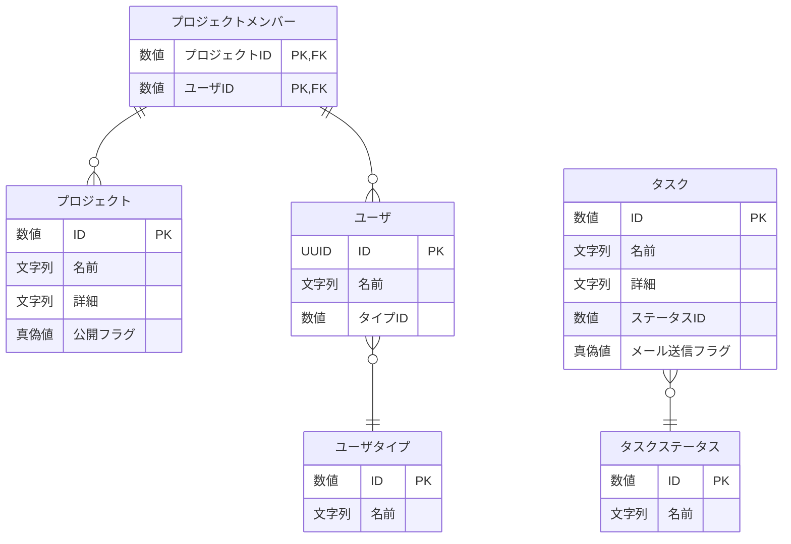

- ※作成日時、更新日時は省略しています。


## CRUDの処理イメージ
CQRS原則に基づき、`更新系はAPI経由`、`参照系はクライアント直アクセス`としています。
### 登録、更新、削除
- データ更新時は`楽観的排他チェック`（存在確認、更新／削除確認）を行います。
- Supabaseは呼び出し側でトランザクション制御ができないため、必要に応じてストアド・プロシージャを作成しました。
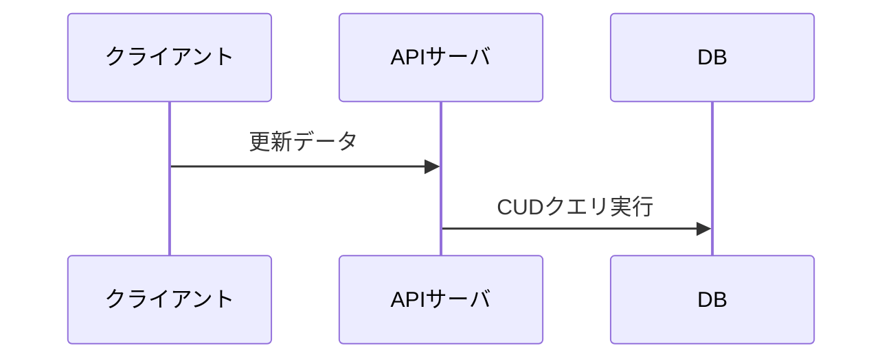
---
### 読込
- クライアントからは`読み取りクエリのみ許可`します。
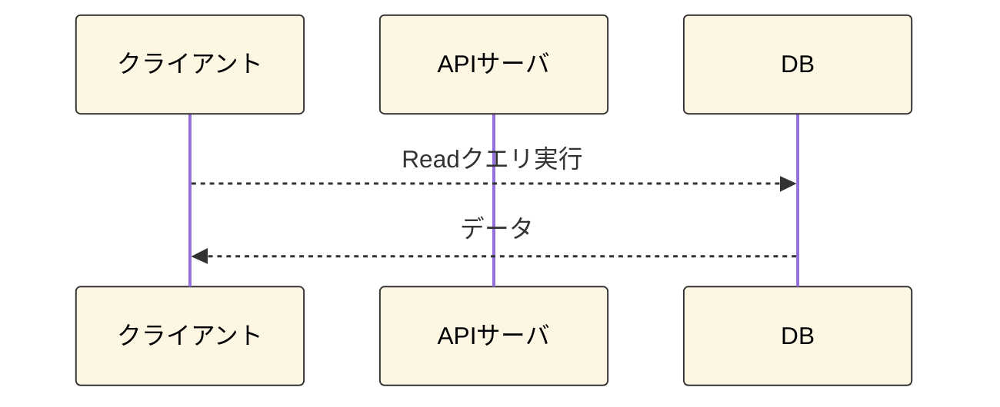

## 認証・認可
### ユーザ登録処理
- ユーザ登録は主に２段階に分かれています。
  - ①Supabaseのユーザ登録（メールアドレスとパスワード）
  - ②アプリ用のユーザ登録（①で登録されたIDとアプリ用ユーザテーブルとの紐づけ）
- 本来は一つのフォーム画面だけで登録を完了したかったが、メール認証との兼ね合いから以下実装としました。

#### 操作の手順

1. メールアドレスとパスワードを入力し新規登録を行います。

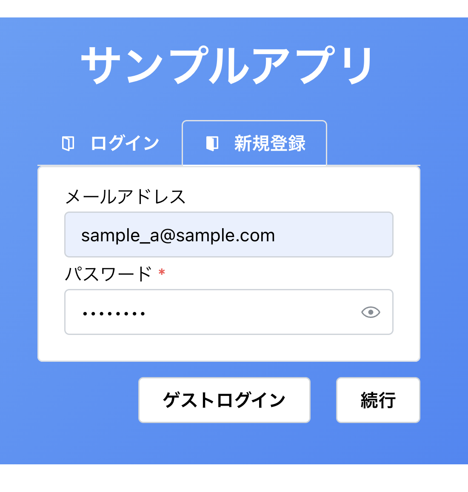
1. 確認メールからリンクをクリックして初回の認証をします。

2. ログインし、ユーザ情報がない場合、ユーザ登録ポップアップを表示します。（ここでアプリ側のユーザ登録を行います。）

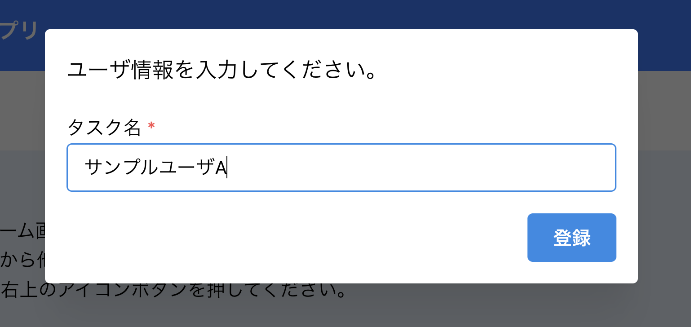


---
### ユーザ認可処理
- ユーザ認可処理では、データベースにアクセスし、`セッションを保持しているかどうか`を確認します。\
しかし、毎回取得処理が走ると通信量やユーザ体験に影響が出るため、`キャッシュによる効率化`を図っています。

#### 処理の流れについて

1. ログイン画面以外の画面アクセスするとユーザ認可処理が走ります。（セッションの確認）
2. セッションが切れている場合、ログイン画面に戻ります。

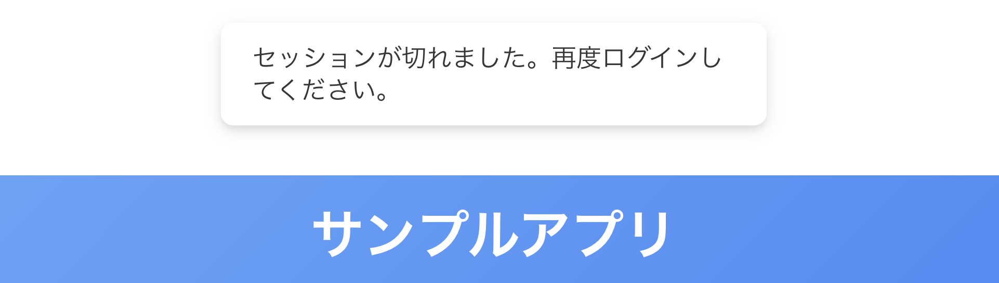


## フォルダ構成
- `feature-based`で構成することで新機能を作る際、コピペして簡単に作れるようにしました。\
（例えば、プロジェクトの画面を作る際はタスクフォルダをそのままコピペして名前を変更するだけで大枠の実装が完了します。）
- フロントエンドとバックエンドを両方同じ機能フォルダに入れることで、フォルダ間の移動の手間を省き、作業効率化を図りました。
```
package/web/app                  # Webアプリ用パッケージ
  ├── (task)/
  │   ├── .../
  ├── (project)/              # 機能ごとにフォルダを分離しています。
  │   ├── _api-client/             # バックエンドAPI呼び出し
  │   ├── _data-access/            # Supabase クエリをラップしたデータ更新層
  │   ├── _hooks/                  # フック
  │   ├── _query/                  # データ取得クエリ。CQRSのQuery側の処理を担当。
  │   ├── _schema/                 # スキーマ（Zodの型を定義する）
  │   ├── _service/                # バックエンド側のビジネスロジック層。
  │   ├── projects/                # 一覧ページのルーティング用フォルダ
  │   │   └── page.tsx                   # プロジェクト一覧ページ
  │   │   ├── api/                       # REST APIの定義
  │   │   ├── ...                        # プロジェクト一覧ページのフォルダ類
  │   │   ├── [id]/                      # 詳細ページの動的ルーティングフォルダ
  │   │   │   ├── page.tsx                    # 詳細ページ
  │   │   │   ├── ...                         # 詳細ページ専用のフォルダ類
  │   │   ├── new/                       # 新規作成ページ
  │   │   │   ├── page.tsx
  ├── (core)/                 # コア機能を格納する
  ├── (shared)/               # 共通で使用するコンポーネントや関数を格納する

package/ai/llm_demo             # LLMサーバ用パッケージ
  ├── .../                   # 構成はWebアプリ用パッケージとほとんど同様のため割愛

```

## 最後に
- 本プロジェクトを御覧いただきありがとうございました。
- 気になる点がありましたら、気軽にお聞きください。
  
